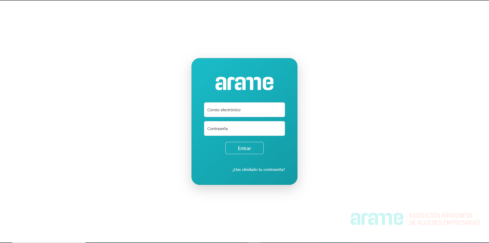

# ArameGest

A custom web application developed for ARAME (Asociación Aragonesa de Mujeres Empresarias, Profesionales, Directivas y Gerentes) to manage member data and streamline administrative tasks. This project showcases my expertise in building tailored, efficient, and secure solutions for organizational needs.

## Features
- Member management: Register, update, and deactivate members.
- Automated receipt generation and email dispatch for payments.
- Role-based access control for secure and personalized user experiences.
- Search and filter tools for quick access to member data.
- Responsive design for use across devices (desktop, tablet, and mobile).

## Technologies Used
- **Frontend:** HTML, CSS, JavaScript.
- **Backend:** PHP.
- **Database:** MySQL.
- **Libraries and Frameworks:** Bootstrap for responsive UI, jQuery for enhanced interactivity.
- **Email Integration:** SMTP for automated email dispatch.

## Screenshot

## Live Demo
[Visit ArameGest](https://aramegest.alcanalytics.com/)

*Note: Access is restricted to authorized users for security purposes.*
