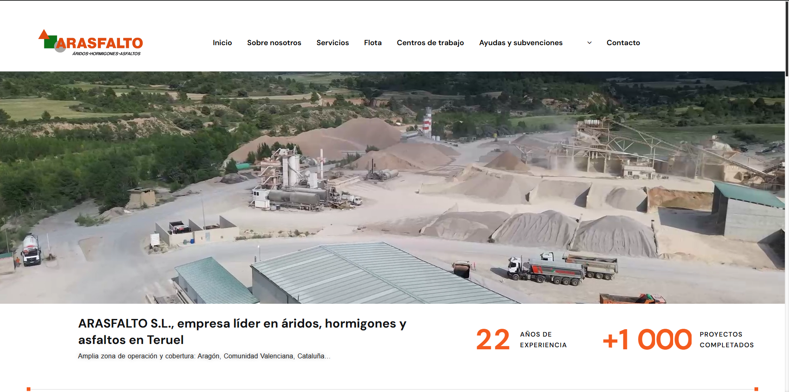

# Arasfalto

A professional and user-friendly website developed for Arasfalto, showcasing their expertise in asphalt solutions and paving projects. This project emphasizes my ability to deliver visually appealing designs, ensure seamless functionality, and optimize for both users and search engines.

## Features
- Modern and responsive design for an optimal experience on all devices.
- Streamlined navigation for easy access to services and information.
- SEO optimization to enhance search engine rankings.
- High-performance pages with fast load times for improved engagement.

## Technologies Used
- WordPress with a tailored theme to reflect the client's branding.
- Elementor for customizable and interactive page designs.
- SEO tools to implement best practices for visibility.
- Speed optimization for quick loading times.

## Screenshot

## Live Demo
[Visit Arasfalto](https://arasfalto.com/)
