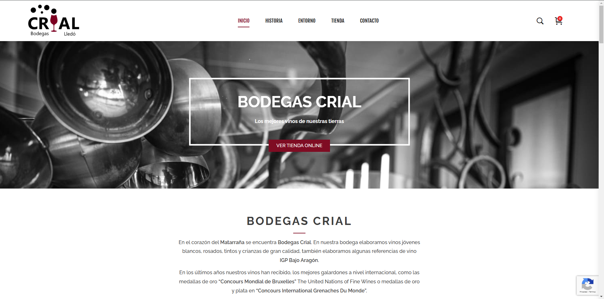

# Bodegas Crial

A responsive and modern website developed for Bodegas Crial, a family-owned winery located in the heart of Matarraña, Spain. This project showcases my ability to create clean designs, optimize user experience, and ensure cross-device compatibility.

## Features
- Responsive design optimized for desktop, tablet, and mobile devices.
- Clear and intuitive navigation to enhance user experience.
- SEO optimization to improve search engine visibility.
- Integration of an online store for direct wine sales.
- Fast-loading pages for better user engagement.

## Technologies Used
- WordPress with a custom theme tailored to the client's brand identity.
- Elementor for flexible and dynamic page layouts.
- WooCommerce for the e-commerce functionality.
- SEO plugins and tools for on-page optimization.
- Performance optimization techniques to ensure quick load times.

## Screenshot

## Live Demo
[Visit Bodegas Crial](https://bodegascrial.es/)

