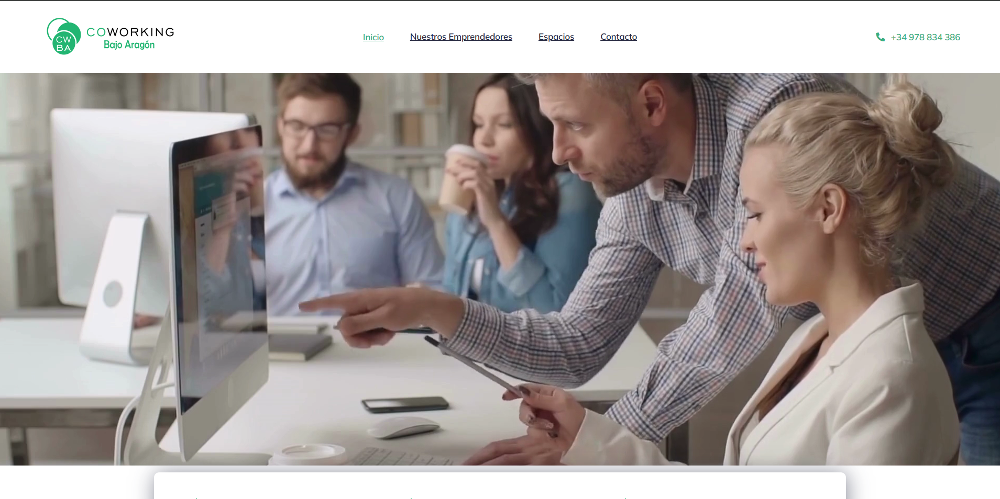

# Coworking Bajo Aragón

A modern and functional website developed for Coworking Bajo Aragón, designed to promote a collaborative workspace environment. This project highlights my ability to create clean, professional designs and optimize usability for potential clients.

## Features
- Responsive design for seamless browsing across devices.
- Clear call-to-actions to encourage inquiries and bookings.
- SEO optimization to improve search engine visibility.
- Fast load times for a smooth user experience.

## Technologies Used
- WordPress with a custom theme tailored to the coworking brand.
- Elementor for flexible and interactive page layouts.
- SEO tools for enhanced search engine rankings.
- Performance tuning for quick and efficient page loads.

## Screenshot

## Live Demo
[Visit Coworking Bajo Aragón](https://coworkingbajoaragon.com/)
