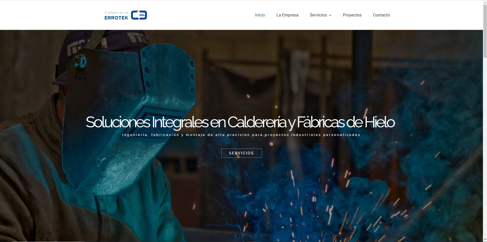

# Errotek

A modern and responsive website developed for Errotek, a company specializing in custom boilermaking and ice factory solutions. This project highlights my skills in creating user-friendly designs, implementing SEO best practices, and ensuring optimal performance across all devices.

## Features
- Responsive design adaptable to desktop, tablet, and mobile devices.
- Clear and intuitive navigation to enhance user experience.
- SEO optimization to improve search engine visibility.
- Fast-loading pages for better user engagement.

## Technologies Used
- WordPress with a custom theme tailored to the client's brand.
- Elementor for flexible and dynamic page layouts.
- SEO plugins and tools for on-page optimization.
- Performance optimization techniques for faster load times.

## Screenshot

## Live Demo
[Visit Errotek](https://errotek.alcanalytics.com/)
