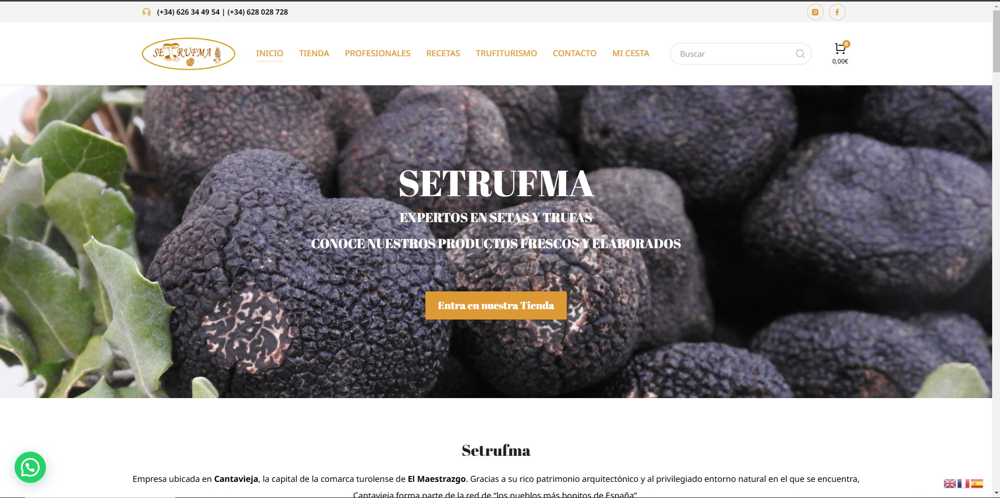

S# Setrufma

An e-commerce website developed for Setrufma, a family-owned business specializing in the collection and sale of high-quality truffles and mushrooms from the Maestrazgo region. 

## Features
- Responsive and mobile-friendly design for optimal accessibility.
- Organized navigation for a smooth user experience.
- SEO optimization to enhance search engine visibility.
- Fast load speeds to improve engagement and usability.

## Technologies Used
- WordPress with a custom theme tailored to Setrufma's branding.
- Elementor for dynamic and interactive page design.
- SEO tools to implement on-page optimization strategies.
- Performance enhancements for quick loading times.

## Screenshot

## Live Demo
[Visit Setrufma](https://setrufma.com/)
