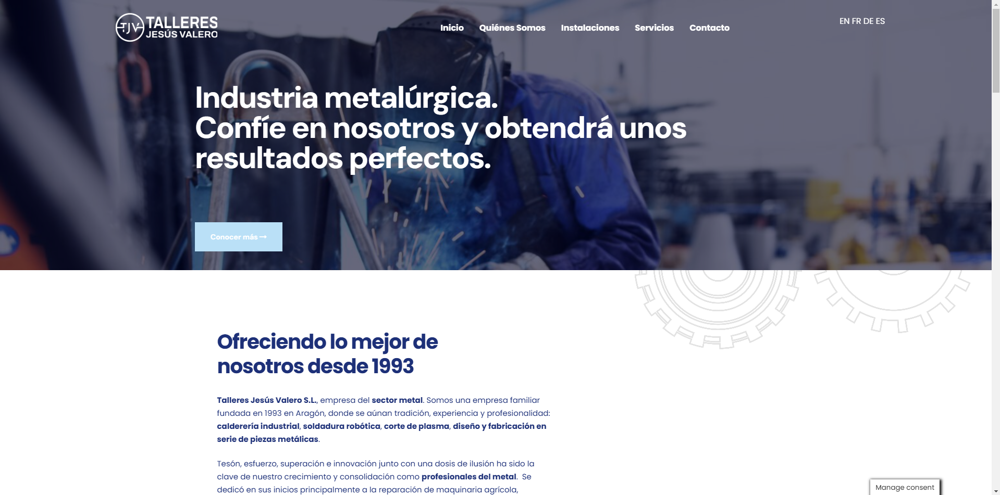

# Talleres Jesús Valero

A responsive and modern website developed for Talleres Jesús Valero, a family-owned metalworking company founded in 1993 in Aragón. This project showcases my ability to create clean designs, optimize user experience, and ensure cross-device compatibility.

## Features
- Responsive design optimized for desktop, tablet, and mobile devices.
- Clear and intuitive navigation to enhance user experience.
- SEO optimization to improve search engine visibility.
- Fast-loading pages for better user engagement.

## Technologies Used
- WordPress with a custom theme tailored to the client's brand identity.
- Elementor for flexible and dynamic page layouts.
- SEO plugins and tools for on-page optimization.
- Performance optimization techniques to ensure quick load times.

## Screenshot

## Live Demo
[Visit Talleres Jesús Valero](https://talleresjesusvalero.es/)
