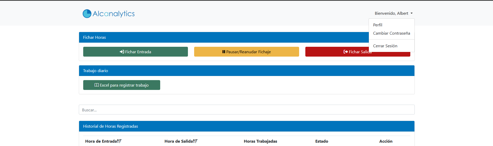
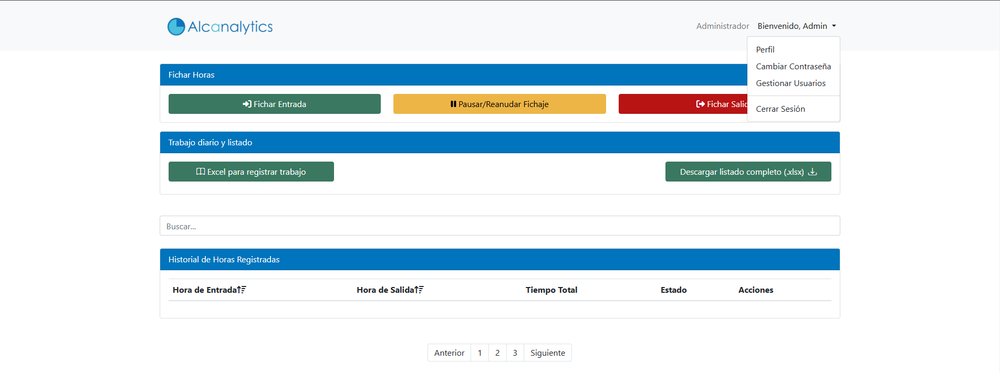

# Time Tracking App

A web application designed to efficiently manage employee time tracking. This tool was developed using modern technologies to ensure a smooth experience and secure data management.

## Features
- Record employee clock-ins and clock-outs.
- User and administrative role management.
- Display statistics and generate detailed reports.
- Secure database for storing time tracking and user data.

## Technologies Used
- **Frontend:** HTML, CSS, JavaScript.
- **Backend:** PHP.
- **Database:** MySQL.
- **Others:** Custom libraries for charts and data validation.

## Screenshots
### Homepage

### Admin Panel

