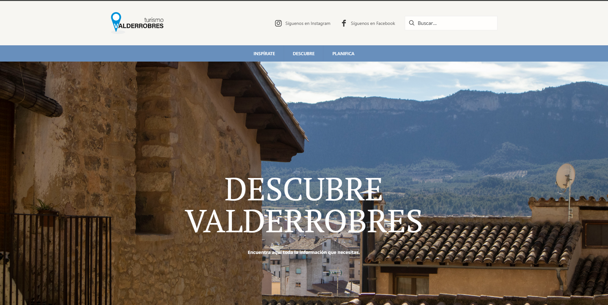

# Turismo Valderrobres

An informative and visually captivating website created for Turismo Valderrobres, promoting the rich cultural heritage and attractions of Valderrobres. This project demonstrates my expertise in crafting engaging designs, user-centric navigation, and content optimization for tourism purposes.

## Features
- Responsive and mobile-friendly design for a seamless user experience.
- Rich visual content to showcase the charm of Valderrobres.
- Intuitive navigation to help users explore attractions and plan their visit.
- SEO optimization to attract visitors through search engines.

## Technologies Used
- WordPress with a customized theme to align with the tourism brand.
- Elementor for dynamic page layouts and flexibility.
- SEO tools for improved visibility in search engines.
- Performance enhancements to ensure fast load times.

## Screenshot

## Live Demo
[Visit Turismo Valderrobres](https://turismovalderrobres.com/)
